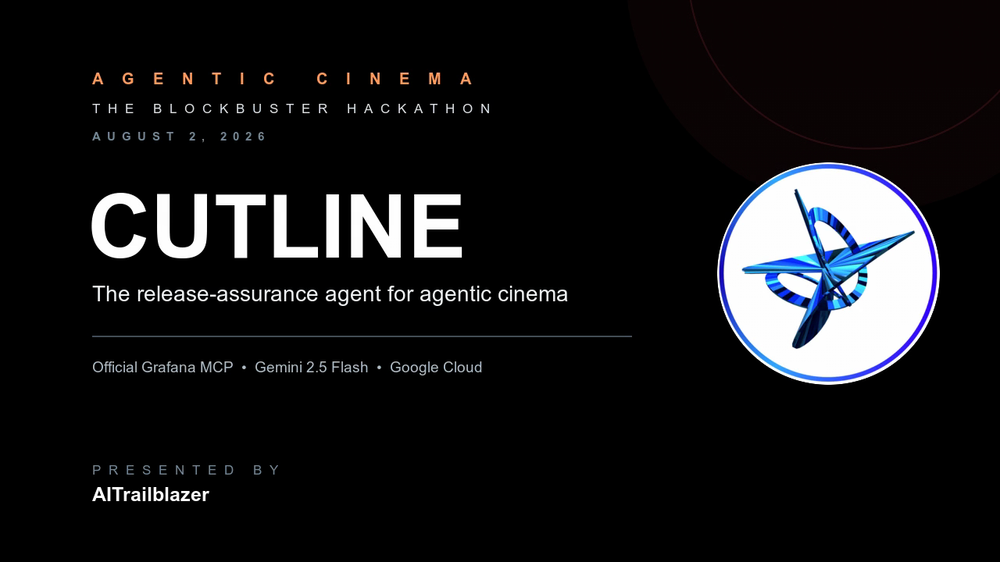
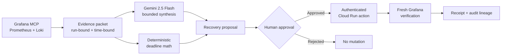
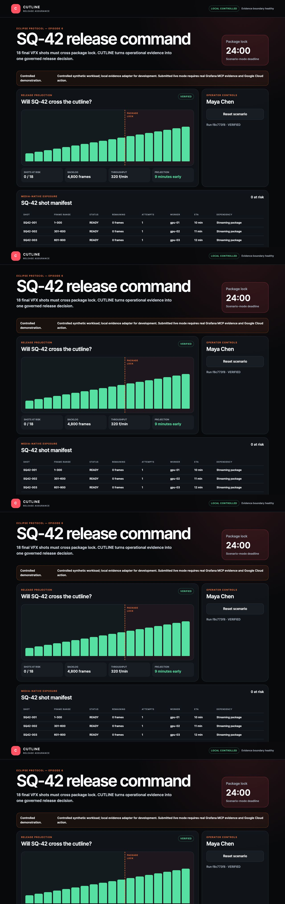

<div align="center">

[](https://cutline-vfz4s45c3q-uc.a.run.app/)

# CUTLINE

### The release-assurance agent for agentic cinema

CUTLINE turns live production evidence into a bounded recovery proposal, keeps
the decision with a human, executes only through an authenticated Google Cloud
boundary, and proves the outcome with fresh telemetry.

[](https://cutline-vfz4s45c3q-uc.a.run.app/)
[](https://youtu.be/yoquhZPl8Cc)
[](https://google.github.io/adk-docs/)
[](https://cloud.google.com/vertex-ai/generative-ai/docs/models/gemini/2-5-flash)
[](https://github.com/grafana/mcp-grafana)
[](qa_evidence/commands/competition_audit_final_closure_gate_2026_08_02.txt)
[](LICENSE)

[**Launch CUTLINE**](https://cutline-vfz4s45c3q-uc.a.run.app/)
· [**Watch the 2-minute demo**](https://youtu.be/yoquhZPl8Cc)
· [**Read the submission package**](docs/CUTLINE_Competition_Submission_Package_2026_07_31.html)

</div>

---

## Why CUTLINE

Agentic cinema can create shots faster, but a production still has to answer a
hard operational question:

> **Will the final shots cross package lock—and can the team prove a safe
> recovery when they will not?**

CUTLINE is not an AI movie generator. It is a release-assurance control plane
for the last mile of agentic production: evidence, diagnosis, human authority,
bounded action, and verification.

The included **Eclipse Protocol / SQ-42** scenario is a controlled,
deterministic demonstration with 18 final VFX shots, 4,800 frames of backlog,
and 24 minutes until package lock. The workload is synthetic; the hosted
Grafana MCP evidence path, Gemini synthesis, and Google Cloud action boundary
are real and disclosed.

## The workflow

| Stage | What CUTLINE does | Authority boundary |
|---|---|---|
| **1. Investigate** | Queries Prometheus and Loki through the official Grafana MCP and binds every item to the active run. | Provider timestamps and run labels are required; stale or mismatched evidence is rejected. |
| **2. Synthesize** | Gives Gemini 2.5 Flash a bounded evidence packet with observations, alternative, discriminator, and falsifier. | The model cannot approve, execute, own authoritative arithmetic, or declare success. |
| **3. Decide** | Shows deadline math and one narrow, reversible recovery proposal. | A named human operator must explicitly approve or reject it. |
| **4. Execute** | Sends the approved allowlisted plan through an authenticated Cloud Run action boundary. | Idempotency and Firestore atomic-create semantics prevent duplicate mutation. |
| **5. Verify** | Retrieves later Grafana evidence and evaluates six deterministic recovery gates. | Execution is not success; only fresh evidence can produce `VERIFIED`. |



## Demonstrated result

| Signal | Before recovery | After recovery |
|---|---:|---:|
| Render throughput | 120 frames/min | 320 frames/min |
| Projected completion | 16 minutes late | 9 minutes early |
| CUDA OOM state | Active | Cleared |
| Verification gates | Not evaluated | 6 / 6 passed |
| Final state | Action required | `VERIFIED` |

The result is evidence from a controlled scenario—not a benchmark claim about
an external studio pipeline.

<details>
<summary><strong>View the verified command center</strong></summary>



</details>

## Architecture

| Layer | Technology | Responsibility |
|---|---|---|
| Agent runtime | Google ADK + Gemini 2.5 Flash on Vertex AI | Evidence-grounded, bounded synthesis |
| Workflow service | FastAPI + Pydantic | State machine, impact arithmetic, approvals, receipts, and verification |
| Observability | Official `grafana/mcp-grafana` | Live Prometheus and Loki queries through discovered MCP schemas |
| Action boundary | Google Cloud Run | Authenticated, allowlisted, idempotent recovery execution |
| Persistence | Firestore | Durable atomic action idempotency |
| Secrets | Google Secret Manager | Runtime-only provider and action credentials |
| Interface | Accessible vanilla web UI | Sequence-first release command and complete evidence disclosure |

### Trust model

- The browser receives no Grafana, Gemini, action, or Google Cloud credentials.
- The private Grafana MCP service uses Google service identity and read-only
  tools.
- A separate write-only credential publishes bounded scenario telemetry.
- The model can synthesize evidence but cannot mutate state or certify success.
- Every approval, action, evidence item, and verification result is bound to one
  run ID.
- Missing providers, identities, datasources, or action configuration fail
  closed.

## Try it

### Hosted demonstration

1. Open [the live Cloud Run app](https://cutline-vfz4s45c3q-uc.a.run.app/).
2. Select **Investigate with Grafana evidence**.
3. Review the evidence-backed diagnosis, alternative, falsifier, and deadline
   math.
4. Approve the bounded recovery as the named operator.
5. Execute the approved plan.
6. Verify with fresh evidence and inspect the receipt and audit lineage.

No private GCP or Grafana credentials are required for the judge-facing flow.

### Local controlled mode

Prerequisites: Python 3.12+, [`uv`](https://docs.astral.sh/uv/), and
[`agents-cli`](https://google.github.io/adk-docs/).

```bash
git clone https://github.com/aitrailblazer/cutline.git
cd cutline
uv sync --dev --extra lint
uv run uvicorn app.fast_api_app:app --host 127.0.0.1 --port 8011
```

Open `http://127.0.0.1:8011`. Local mode uses deterministic adapters, is clearly
labeled `LOCAL CONTROLLED`, and makes no live-provider claim.

## Live integration contract

Copy `.env.example` to `.env` and provide deployment values through Secret
Manager. Never commit secrets.

```text
CUTLINE_MODE=live
GRAFANA_MCP_URL=https://<private-mcp-cloud-run-service>
GRAFANA_MCP_TOKEN=
GRAFANA_MCP_USE_GOOGLE_ID_TOKEN=true
GRAFANA_MCP_AUDIENCE=https://<private-mcp-cloud-run-service>
CUTLINE_ACTION_URL=https://<cloud-run-action-service>
CUTLINE_ACTION_TOKEN=<secret-manager-injected-action-token>
```

The Grafana endpoint must expose the official `list_datasources`,
`query_prometheus`, and `query_loki_logs` operations. CUTLINE discovers explicit
datasource UIDs and rejects missing, stale, malformed, or run-mismatched
results.

`deploy/grafana-mcp/Dockerfile` pins the official Grafana MCP image used by the
private Cloud Run evidence boundary. Write tools are disabled in that service.

## Quality and evidence

```bash
./scripts/test
agents-cli lint
node --check app/web/app.js
```

- **51 automated tests**
- **732 deterministic statements at 100% coverage**
- **128 deterministic branches at 100% coverage**
- **43/43 user-visible feature stories verified**
- **100 Lighthouse scores** for accessibility, best practices, SEO, and
  agentic browsing in the final hosted audit

The canonical audit source is
[`feature_status_tracker.csv`](feature_status_tracker.csv). Its generated views
are [`feature_status_tracker.xlsx`](feature_status_tracker.xlsx) and
[`feature_status_tracker.html`](feature_status_tracker.html). The final closure
gate is preserved in
[`qa_evidence/commands/competition_audit_final_closure_gate_2026_08_02.txt`](qa_evidence/commands/competition_audit_final_closure_gate_2026_08_02.txt).

## Project map

```text
app/                    Workflow, adapters, agent runtime, API, and web UI
deploy/grafana-mcp/     Pinned official Grafana MCP Cloud Run image
docs/                   Product spec, execution plan, and submission package
qa_evidence/            Reproducible test, browser, cloud, and media evidence
tests/                  Unit, integration, workflow, and evaluation coverage
feature_status_tracker.* Canonical audit plus generated human views
```

## Documentation

- [Winning product specification](docs/CUTLINE_Winning_Product_Spec_2026_07_31.html)
- [Execution plan](docs/CUTLINE_Execution_Plan_2026_07_31.html)
- [Competition submission package](docs/CUTLINE_Competition_Submission_Package_2026_07_31.html)
- [Feature QA report](feature_qa_report.md)
- [Changelog](CHANGELOG.md)

## Deployment

The public hosted revision runs with Gemini 2.5 Flash on Vertex AI, a private
official Grafana MCP Cloud Run service, and an authenticated Google Cloud action
boundary.

```bash
gcloud config set project <dedicated-cutline-project>
agents-cli deploy
```

Local tests never deploy infrastructure, mutate billing, or start a managed
paid evaluation.

## License

Licensed under the [Apache License 2.0](LICENSE).

---

<div align="center">

**Evidence. Human authority. Bounded action. Proof.**

[Launch CUTLINE](https://cutline-vfz4s45c3q-uc.a.run.app/)
· [Watch the demo](https://youtu.be/yoquhZPl8Cc)
· [Explore the evidence](feature_status_tracker.html)

</div>
